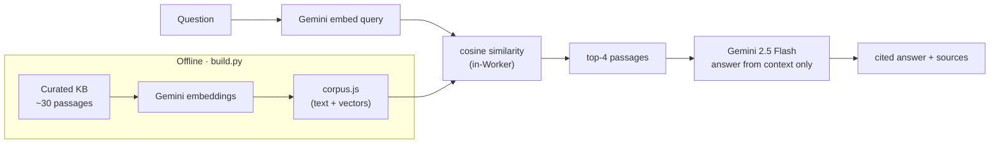

# Ask Space Weather

A small **retrieval-augmented-generation (RAG)** assistant. Ask a space-weather question and it answers from a curated knowledge base — **with citations** — instead of guessing. If the answer isn't in its sources, it says so.

**▶ Live: [ask.dsremo.com](https://ask.dsremo.com)**

## Why RAG (and why it matters)

A plain language model will confidently make things up. RAG fixes that: instead of answering from memory, it first **retrieves** the most relevant passages from a trusted knowledge base and asks the model to answer **only from those** — then shows you the sources. It's the standard pattern for trustworthy AI over a known body of content (docs, policies, support articles).

This one is grounded in ~30 curated, factual space-weather passages (Kp index, solar wind, CMEs, the NOAA storm scales, historical storms like Carrington and the 2024 Gannon event, grid/satellite/GPS impacts, forecasting).

## How it works



The knowledge base is embedded **offline** and bundled with the Worker, so there's **no vector database to run** — retrieval is a cosine-similarity scan in the Worker itself. At query time: embed the question, find the closest passages, and have Gemini answer strictly from them with inline `[n]` citations.

## Tech stack

Cloudflare Workers (serverless) · Google Gemini (`gemini-embedding-001` for vectors, `gemini-2.5-flash` for answers) · in-Worker cosine retrieval (no vector DB) · vanilla-JS chat UI.

## Run it

```bash
python build.py        # embeds the KB -> src/corpus.js  (needs GEMINI_API_KEY)
wrangler secret put GEMINI_API_KEY
wrangler deploy
```

## Status

Live. A focused, honest demo of the RAG pattern: grounded answers with citations, and an explicit "I don't have that" when a question falls outside the knowledge base. The corpus is hand-curated for the demo, not a comprehensive reference.

Built by Ashutosh Tiwari.
